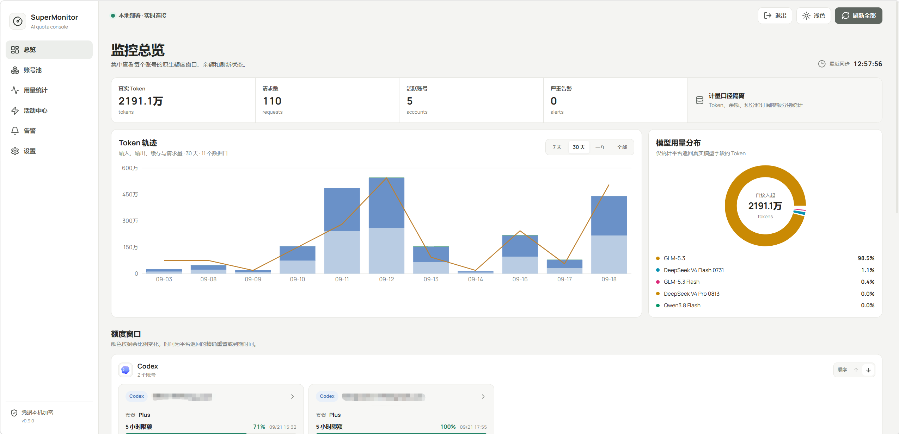
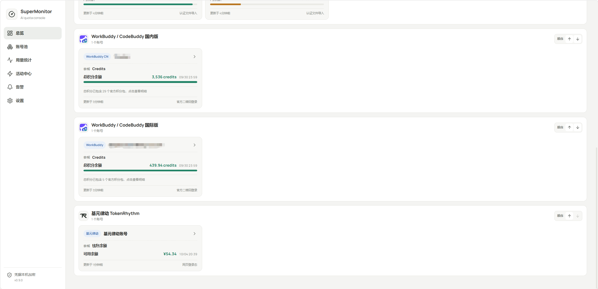
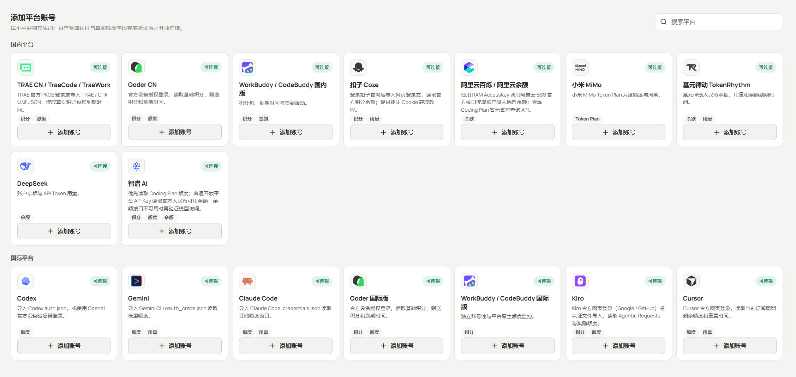
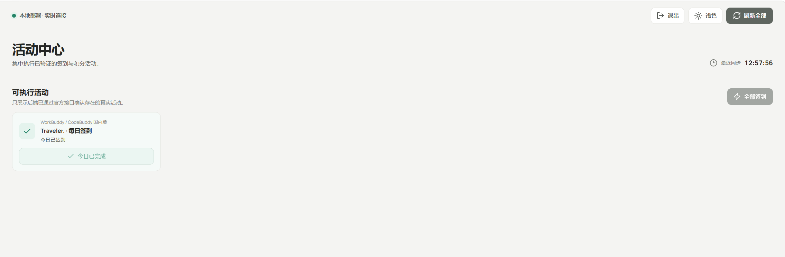
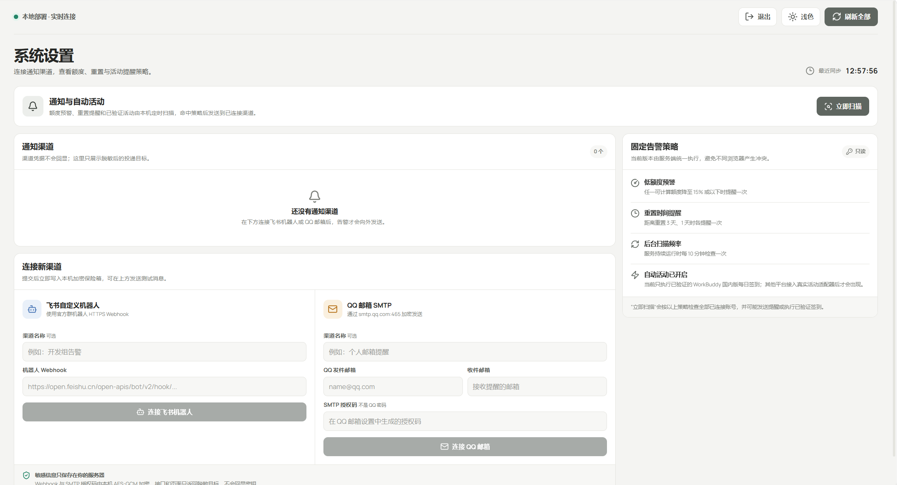

# SuperMonitor

<p align="center">
  <strong>面向 AI 与 Coding Agent 的自托管额度监控台</strong><br>
  统一查看多平台账号池、真实额度、积分、余额、重置周期、Token 用量、活动与告警。
</p>

<p align="center">
  <a href="https://github.com/Denght123/SuperMonitor/actions/workflows/ci.yml"></a>
  <a href="https://github.com/Denght123/SuperMonitor/releases"></a>
  <a href="https://github.com/Denght123/SuperMonitor/blob/main/LICENSE"></a>
  
  
</p>

> 当前版本：**v0.9.0**。SuperMonitor 只负责监控与提醒，不代理模型请求，不做 API 转发、账号轮换或请求路由。



## 目录

- [为什么使用 SuperMonitor](#为什么使用-supermonitor)
- [界面预览](#界面预览)
- [支持平台](#支持平台)
- [快速部署](#快速部署)
- [首次使用](#首次使用)
- [生产环境反向代理](#生产环境反向代理)
- [systemd 部署示例](#systemd-部署示例)
- [环境变量](#环境变量)
- [自动同步、告警与活动](#自动同步告警与活动)
- [数据、备份与恢复](#数据备份与恢复)
- [升级](#升级)
- [安全与隐私](#安全与隐私)
- [常见问题](#常见问题)
- [本地开发](#本地开发)

## 为什么使用 SuperMonitor

AI 编程工具的计费口径并不统一：有的平台返回百分比额度窗口，有的平台使用 Credits，有的平台展示人民币余额，还有的平台只提供 Token Plan 或请求历史。SuperMonitor 保留平台原生口径，将多个平台、多个账号集中到一个简洁的控制台中。

- **多平台账号池**：同一平台可添加多个账号，单独刷新、删除并调整平台展示顺序。
- **真实原生数据**：百分比、Credits、人民币余额、Token 与重置时间分别展示，不用模拟数据填充缺失字段。
- **后台自动同步**：服务端默认每 15 分钟低频刷新，即使浏览器关闭也会继续运行。
- **用量分析**：按 7 天、30 天、一年或全部历史查看 Token 趋势与模型使用占比。
- **活动中心**：只展示已验证的真实活动；当前支持 WorkBuddy 国内版每日签到。
- **额度告警**：支持飞书自定义机器人与 QQ 邮箱 SMTP，覆盖低额度和重置时间提醒。
- **本地凭据保险箱**：敏感凭据由 AES-GCM 加密，上传的认证文件只在内存中解析，不作为文件保存。
- **流式更新**：前端通过事件流接收同步结果与操作反馈，不需要反复刷新页面。

## 界面预览

### 原生计量口径与多账号额度卡片

Codex 使用剩余百分比与重置时间，WorkBuddy 使用 Credits，基元律动使用人民币余额；每个账号保持独立展示。



### 按平台添加账号

国内与国际平台分区展示，每个平台只提供与其实际适配器匹配的认证方式。



<table>
  <tr>
    <td width="50%" valign="top">
      <strong>活动中心</strong><br><br>
      
    </td>
    <td width="50%" valign="top">
      <strong>通知与自动活动</strong><br><br>
      
    </td>
  </tr>
</table>

## 支持平台

第三方平台的网页登录接口可能随时变化。表格中的“社区适配”表示 SuperMonitor 已实现对应连接器，但它依赖平台实际网页或客户端协议；“官方 API”表示使用平台公开的账户接口。SuperMonitor 不会在接口不可用时生成虚假额度。

| 平台 | 区域 | 连接方式 | 展示内容 |
| --- | --- | --- | --- |
| TRAE CN / TraeCode / TraeWork | 国内 | 官方 PKCE 登录、TRAE/CPA 认证 JSON | 积分包、额度、到期时间 |
| Qoder CN | 国内 | 官方设备授权、认证文件 | 基础积分、赠送积分、额度与到期时间 |
| WorkBuddy / CodeBuddy 国内版 | 国内 | 官方二维码登录、认证文件 | Credits、积分包到期时间、每日签到 |
| 扣子 Coze | 国内 | 网页登录态 Cookie | 官方积分余额、用量 |
| 阿里云百炼 / 阿里云余额 | 国内 | RAM AccessKey | 阿里云 BSS 账户人民币余额 |
| 小米 MiMo | 国内 | 网页登录态 Cookie | Token Plan 月度额度与周期 |
| 基元律动 TokenRhythm | 国内 | `sess_` Session Token、`tr_session` Cookie | 人民币余额、到期时间、Token/请求/模型统计 |
| DeepSeek | 国内 | API Key | 官方账户余额 |
| 智谱 AI | 国内 | API Key | Coding Plan 额度或开放平台人民币余额 |
| Codex | 国际 | OpenAI 设备验证码、原生/CPA/Sub2API 认证 JSON | 5 小时与周额度、套餐、重置时间 |
| Gemini CLI | 国际 | `oauth_creds.json` | Code Assist 模型额度与用量 |
| Claude Code | 国际 | `.credentials.json` | 5 小时、周额度及模型专属窗口 |
| Qoder 国际版 | 国际 | 官方设备授权、认证文件 | 基础积分、赠送积分、额度与到期时间 |
| WorkBuddy / CodeBuddy 国际版 | 国际 | 官方二维码登录、认证文件 | Credits |
| Kiro | 国际 | Google/GitHub 网页登录、认证文件 | Agentic Requests、奖励额度与重置周期 |
| Cursor | 国际 | 官方网页登录、认证文件 | 订阅周期额度、用量与重置时间 |

> 阿里云百炼 Coding Plan 目前没有可用的官方查询 API；现有适配器读取的是阿里云 BSS 账户级人民币余额。平台端没有返回的数据不会被推算成“剩余额度”。

## 快速部署

### 方式一：Docker Compose（推荐）

要求：Docker Engine 24+ 与 Docker Compose v2。

```bash
git clone https://github.com/Denght123/SuperMonitor.git
cd SuperMonitor
cp .env.example .env
```

生成至少 12 个字符的管理密码：

```bash
openssl rand -hex 32
```

编辑 `.env`，至少设置：

```dotenv
SUPMON_ADMIN_PASSWORD=请替换为刚刚生成的随机密码
```

启动服务：

```bash
docker compose up -d --build
docker compose ps
curl http://127.0.0.1:8080/healthz
```

默认只发布到宿主机的 `127.0.0.1:8080`。本机使用可直接访问 [http://127.0.0.1:8080](http://127.0.0.1:8080)；公网部署请继续配置下方的 HTTPS 反向代理，不要直接暴露 8080 端口。

查看日志：

```bash
docker compose logs -f --tail=200 supermonitor
```

### 方式二：直接运行 Docker 容器

```bash
docker build --build-arg VERSION=v0.9.0 -t supermonitor:v0.9.0 .
docker volume create supermonitor-data
docker run -d \
  --name supermonitor \
  --restart unless-stopped \
  -p 127.0.0.1:8080:8080 \
  -e SUPMON_ADMIN_PASSWORD='替换为至少12个字符的强密码' \
  -e SUPMON_DATA_DIR=/app/data \
  -v supermonitor-data:/app/data \
  supermonitor:v0.9.0
```

### 方式三：从源码构建

要求：Go 1.25+、Node.js 24+、npm 11+。

```bash
git clone https://github.com/Denght123/SuperMonitor.git
cd SuperMonitor

cd web
npm ci
npm run api:generate
npm run build
cd ..

go test ./...
go build -trimpath -ldflags "-s -w -X main.version=v0.9.0" -o bin/supermonitor ./cmd/supermonitor

SUPMON_LISTEN=127.0.0.1:8080 \
SUPMON_DATA_DIR=./data \
SUPMON_ADMIN_PASSWORD='替换为至少12个字符的强密码' \
./bin/supermonitor
```

Windows PowerShell 可使用：

```powershell
$env:SUPMON_LISTEN = "127.0.0.1:8080"
$env:SUPMON_DATA_DIR = "G:\SuperMonitor-data"
$env:SUPMON_ADMIN_PASSWORD = Read-Host "管理密码（至少 12 个字符）" -MaskInput
.\bin\supermonitor.exe
```

## 首次使用

1. 打开 SuperMonitor 地址。
2. 在连接页确认“连接地址”，输入部署时配置的管理密码。密码只用于换取 HttpOnly 会话，不写入 URL 或浏览器存储。
3. 进入“账号池”，选择平台并按照页面引导完成 OAuth、扫码、认证文件导入或密钥连接。
4. 连接成功后会立即读取一次真实额度；后端随后按低频计划自动同步。
5. 在“总览”查看额度，在“用量统计”查看 Token 趋势，在“活动中心”执行可用活动。
6. 如需外部提醒，在“设置”连接飞书机器人或 QQ 邮箱 SMTP，并先发送测试消息。

同一平台可以添加多个账号。账号卡片支持独立刷新与删除，平台分组可调整顺序；删除操作会同时移除该账号的加密凭据、额度缓存、用量记录、活动与告警状态。

## 生产环境反向代理

应用应继续监听本机回环地址，由 Nginx/Caddy 等可信代理终止 HTTPS。下面是 Nginx 示例：

```nginx
server {
    listen 80;
    server_name monitor.example.com;
    return 301 https://$host$request_uri;
}

server {
    listen 443 ssl http2;
    server_name monitor.example.com;

    ssl_certificate     /etc/letsencrypt/live/monitor.example.com/fullchain.pem;
    ssl_certificate_key /etc/letsencrypt/live/monitor.example.com/privkey.pem;

    client_max_body_size 2m;

    location / {
        proxy_pass http://127.0.0.1:8080;
        proxy_http_version 1.1;

        proxy_set_header Host $http_host;
        proxy_set_header X-Forwarded-Host $http_host;
        proxy_set_header X-Forwarded-Proto $scheme;
        proxy_set_header X-Forwarded-For $remote_addr;

        # 保持事件流和较长的 OAuth/额度请求可用
        proxy_buffering off;
        proxy_read_timeout 3600s;
    }
}
```

注意：

- 后端端口只允许反向代理访问；不要让不受信任的客户端直接访问 8080。
- 不要原样信任客户端传来的 `X-Forwarded-*` 请求头，应由反向代理覆盖。
- 使用 Cloudflare 时请选择 **Full (strict)**，不要使用 Flexible SSL。
- OAuth 回调依赖正确的公网 Host 与 HTTPS Scheme，反向代理必须传递上面的 Host 与 Scheme。
- 登录页支持 CPA 风格的“连接地址 + 管理密码”；只连接你信任的 SuperMonitor 实例。

## systemd 部署示例

源码构建完成后，将二进制复制到 `/opt/supermonitor/supermonitor`，再创建专用用户与数据目录：

```bash
sudo useradd --system --home /var/lib/supermonitor --shell /usr/sbin/nologin supermonitor
sudo install -d -m 750 -o supermonitor -g supermonitor /var/lib/supermonitor
sudo install -d -m 755 /opt/supermonitor
sudo install -m 755 bin/supermonitor /opt/supermonitor/supermonitor
sudo install -d -m 750 /etc/supermonitor
```

创建 `/etc/supermonitor/supermonitor.env`：

```dotenv
SUPMON_LISTEN=127.0.0.1:8080
SUPMON_DATA_DIR=/var/lib/supermonitor
SUPMON_ENVIRONMENT=production
SUPMON_ADMIN_PASSWORD=替换为至少12个字符的强密码
SUPMON_SYNC_TIMEOUT=10m
```

保护环境文件：

```bash
sudo chown root:supermonitor /etc/supermonitor/supermonitor.env
sudo chmod 640 /etc/supermonitor/supermonitor.env
```

创建 `/etc/systemd/system/supermonitor.service`：

```ini
[Unit]
Description=SuperMonitor AI quota console
After=network-online.target
Wants=network-online.target

[Service]
Type=simple
User=supermonitor
Group=supermonitor
EnvironmentFile=/etc/supermonitor/supermonitor.env
ExecStart=/opt/supermonitor/supermonitor
Restart=on-failure
RestartSec=5s
NoNewPrivileges=true
PrivateTmp=true
ProtectSystem=strict
ProtectHome=true
ReadWritePaths=/var/lib/supermonitor

[Install]
WantedBy=multi-user.target
```

```bash
sudo systemctl daemon-reload
sudo systemctl enable --now supermonitor
sudo systemctl status supermonitor
curl http://127.0.0.1:8080/healthz
```

## 环境变量

| 变量 | 默认值 | 说明 |
| --- | --- | --- |
| `SUPMON_LISTEN` | `127.0.0.1:8080` | HTTP 监听地址。非回环地址必须配置管理密码，或显式启用不安全模式。 |
| `SUPMON_DATA_DIR` | `./data` | SQLite、加密密钥和默认日志所在目录，必须持久化并限制访问权限。 |
| `SUPMON_ENVIRONMENT` | `local` | 运行环境标识，用于界面与诊断信息。 |
| `SUPMON_ADMIN_PASSWORD` | 空 | 管理密码，至少 12 个 Unicode 字符。公网或非回环监听必须设置。 |
| `SUPMON_ADMIN_TOKEN` | 空 | 旧版本兼容变量，仅在管理密码为空时读取；新部署不要使用。 |
| `SUPMON_SYNC_TIMEOUT` | `10m` | 一轮全量同步的最长时间，不能小于 1 分钟；单账号另有 45 秒超时。 |
| `SUPMON_PROXY_URL` | 空 | 可选的 HTTP(S) 出站代理，例如 `http://127.0.0.1:7890`。 |
| `SUPMON_LOG_FILE` | 数据目录下的 `supermonitor.log` | 指定日志文件；设为 `-` 时只输出到 stdout。默认 10 MiB 轮转并保留一份备份。 |
| `SUPMON_ALLOW_INSECURE_REMOTE` | `false` | 危险开关。只应在外层已有可信隔离时使用，公网部署保持 `false`。 |
| `SUPMON_GEMINI_OAUTH_CLIENT_ID` | 空 | Gemini CLI Token 过期后自动刷新所需的部署方 OAuth Client ID。 |
| `SUPMON_GEMINI_OAUTH_CLIENT_SECRET` | 空 | 与上项配套的 OAuth Client Secret。 |

完整模板见 [`.env.example`](.env.example)。Docker Compose 会自动读取仓库根目录的 `.env`，该文件已被 `.gitignore` 排除。

## 自动同步、告警与活动

- 服务启动后会加入随机抖动并每 15 分钟同步账号，避免多个实例同时冲击平台接口。
- 每个账号独立设置 45 秒超时；一轮同步最多并发 4 个平台请求，整轮默认最多 10 分钟。
- 手动“刷新全部”会推迟下一次计划任务，不会立刻产生重复请求风暴。
- 百分比额度降至 15% 或以下时提醒一次，恢复后才会重新布防。
- 平台返回重置时间时，在剩余 3 天与 1 天分别提醒一次。
- 通知状态每 10 分钟扫描；账号刷新后也会重新扫描活动。
- 只有经过真实适配器验证的活动才允许自动执行。目前自动活动为 WorkBuddy 国内版每日签到。

调度状态可通过 `GET /api/v1/sync/status` 查看。

## 数据、备份与恢复

`SUPMON_DATA_DIR` 中最重要的文件包括：

- `supermonitor.db`：账号元数据、额度缓存、用量、告警与活动状态。
- `credential.key`：解密账号凭据所需的本地密钥。
- `supermonitor.log`：经过脱敏的结构化日志（使用默认日志设置时）。

**数据库与 `credential.key` 必须成对备份。** 丢失密钥后，数据库中的加密凭据无法恢复；只备份数据库不能恢复账号连接。

Docker Compose 备份示例：

```bash
mkdir -p backups/supermonitor-data
docker compose stop supermonitor
docker cp "$(docker compose ps -aq supermonitor):/app/data/." ./backups/supermonitor-data/
docker compose start supermonitor
tar -czf "backups/supermonitor-$(date +%Y%m%d-%H%M%S).tar.gz" -C backups/supermonitor-data .
```

原生部署可停止服务后备份整个数据目录：

```bash
sudo systemctl stop supermonitor
sudo tar -czf "supermonitor-$(date +%Y%m%d-%H%M%S).tar.gz" -C /var/lib/supermonitor .
sudo systemctl start supermonitor
```

恢复时停止服务，用同一份备份完整替换数据目录，确认所有者与权限正确后再启动。不要把备份文件上传到公开网盘或提交到 Git。

## 升级

升级前先备份数据目录，然后更新代码并重建：

```bash
git pull --ff-only
docker compose up -d --build
curl http://127.0.0.1:8080/healthz
docker compose logs --tail=100 supermonitor
```

生产环境建议检出明确的 Release Tag，而不是长期跟随 `main`。降级前必须使用与目标版本匹配的备份，避免新版本数据结构无法被旧版本读取。

## 安全与隐私

- 管理密码不会放入 URL，也不会写入浏览器本地存储；登录后换取随机 HttpOnly、SameSite 会话。
- 普通会话有效期为 12 小时；选择“保持登录”后有效期为 30 天。
- 自动化客户端可使用 `Authorization: Bearer <管理密码>`，不要在脚本、终端历史或 CI 日志中泄漏密码。
- OAuth Token、API Key、Cookie、Webhook 与 SMTP 授权码使用本机 AES-GCM 密钥加密后写入数据库，接口只返回脱敏信息。
- 上传的认证 JSON 只在内存中解析，不会原样落盘；日志会对敏感字段脱敏。
- 永远不要提交 `.env`、`data/`、数据库、日志、备份、认证文件、OAuth 导出或密钥文件。
- 建议使用独立低权限系统用户，数据目录权限设为 `750` 或更严格，并定期离线加密备份。
- 只从可信设备访问控制台，公网部署必须启用 HTTPS 和强管理密码。

如果不设置管理密码，应用只允许默认的本机回环监听。`SUPMON_ALLOW_INSECURE_REMOTE=true` 会跳过这项保护，不建议在任何可被其他设备访问的网络中使用。

## 常见问题

<details>
<summary><strong>连接后为什么没有显示某一项额度？</strong></summary>

SuperMonitor 只展示平台真实返回的字段。如果平台没有返回余额、重置时间或模型明细，不会用演示值或推算值补齐。先对该账号执行单独刷新，并查看界面错误与服务日志。
</details>

<details>
<summary><strong>OAuth 成功后页面没有回到控制台怎么办？</strong></summary>

确认公网域名使用 HTTPS，反向代理覆盖并传递了正确的 `Host`、`X-Forwarded-Host` 与 `X-Forwarded-Proto`。同时检查浏览器是否拦截了弹窗或第三方登录页面。
</details>

<details>
<summary><strong>Codex、Gemini、Claude 等国际平台请求超时怎么办？</strong></summary>

先确认服务器所在网络可以直接访问对应官方域名。如需代理，配置 `SUPMON_PROXY_URL` 后重启服务。Windows 原生运行还会自动遵循当前用户的系统代理设置。
</details>

<details>
<summary><strong>为什么 Token 图表为空？</strong></summary>

只有平台真实返回 Token 或模型维度数据时才会写入统计。Credits、人民币余额和额度百分比不会被伪装成 Token。首次接入后也需要至少一次成功同步才能建立数据点。
</details>

<details>
<summary><strong>如何检查服务是否正常？</strong></summary>

访问 `/healthz` 检查进程与版本；查看 `/api/v1/sync/status` 检查后台同步状态；Docker 使用 `docker compose logs`，systemd 使用 `journalctl -u supermonitor` 查看日志。
</details>

## 本地开发

后端：

```bash
go run ./cmd/supermonitor
```

前端（另开终端）：

```bash
cd web
npm ci
npm run api:generate
npm run dev
```

Vite 会将 `/api` 代理到 `http://127.0.0.1:8080`。提交前执行：

```bash
make verify
```

常用命令：

| 命令 | 作用 |
| --- | --- |
| `make web-generate` | 根据 OpenAPI 重新生成前端类型 |
| `make web-check` | 前端类型检查、Lint 与测试 |
| `make web-build` | 构建生产前端资源 |
| `make go-check` | Go 格式化与静态检查 |
| `make test` | 运行 Go 与前端测试 |
| `make verify` | 执行完整提交前验证 |

API 契约位于 [`api/openapi.yaml`](api/openapi.yaml)。这是一个 monitoring-only API，不包含任何模型代理端点。

## 项目边界

SuperMonitor 的目标是让用户看清自己的账号额度与使用情况。项目明确不提供：

- 模型 API 反向代理
- 请求路由或负载均衡
- 自动切换、共享或轮换账号
- 绕过平台地区、风控、计费或使用限制
- 平台未返回数据的模拟与伪造

各平台名称、Logo 与商标归其各自所有者；本项目与这些平台没有官方隶属或背书关系。使用时请遵守对应平台服务条款与当地法律法规。

## 参与贡献

欢迎提交 Issue 与 Pull Request。新增或修复平台适配器时，请同时提供：

1. 可复现的接口字段说明与脱敏响应样例；
2. 凭据、错误信息和日志的脱敏处理；
3. 单元测试或可选的显式 Live Test；
4. 对 README、OpenAPI 与前端字段的同步更新。

请勿在 Issue、日志或截图中公开真实 Token、Cookie、API Key、邮箱授权码和认证文件。

## License

SuperMonitor 使用 [GNU Affero General Public License v3.0](LICENSE) 开源。
